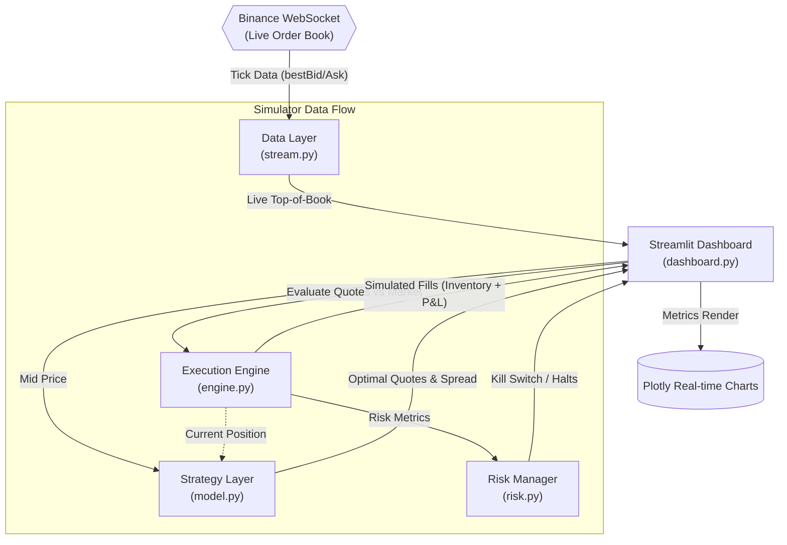
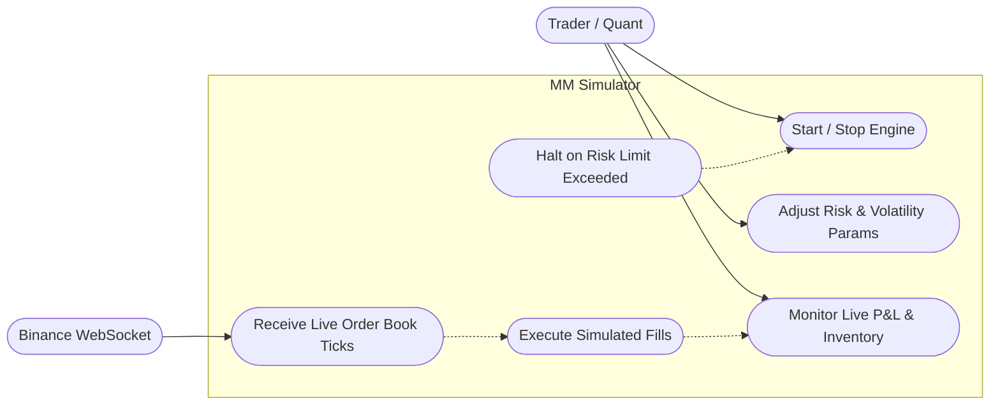
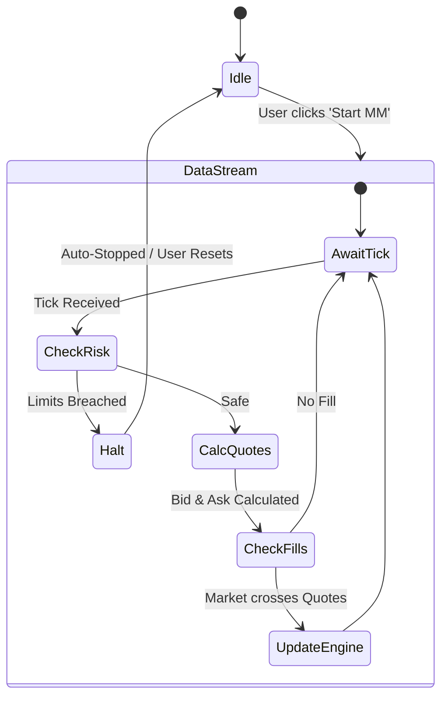

<h1 align="center">Real-Time Market Making Simulator 📈</h1>

<p align="center">
  <strong>A professional-grade quoting simulator using the Avellaneda-Stoikov model on live Binance order book data.</strong>
</p>

<p align="center">
  
  
  
  
</p>

---

## ⚡ Overview

This repository features a live trading demonstration that perfectly illustrates the intersection of deterministic infrastructure and stochastic control theory. The simulator connects to real-time crypto markets (via free Binance WebSockets), computes high-frequency bid/ask quotes dynamically based on inventory exposure, and visualizes live P&L data using a sleek Streamlit dashboard. 

It replicates the fundamental architecture of what quantitative developers handle at firms like Jane Street—from maintaining low-latency data feeds to implementing risk limits and automated kill switches against drawdowns.

---

## 🚀 Features

- **Live Order Book Sync:** Streams real `BTCUSDT` tick data over WebSockets (latency-optimized background threading).
- **Dynamic Quoting (Avellaneda-Stoikov):** Calculates optimal bid and ask spreads using stochastic control parameters.
  - Generates a tailored **Reservation Price** factoring in your current inventory skew.
  - Dynamically widens or narrows **Optimal Spread** based on market volatility and set liquidity density.
- **Simulated Real-time Fills:** Top-of-book crossover deterministic matching system. Watch your inventory spike as market swings trigger fill conditions against your quotes!
- **Strict Risk Management Layer:** Built-in "Kill Switch" circuitry that bounds maximum inventory ($BTC) and caps unrealized drawdowns.
- **Live Analytical Dashboard:** Instant visualization of realized/unrealized P&L, quote distribution relative to mid-price, and inventory positioning using responsive Plotly charts.

---

## 🏗️ Architecture



The simulator is built entirely in Python, reflecting a modular, micro-service-like component design:

```text
📁 mm-simulator/
├── stream.py          # WebSocket Manager feeding order-book top states to shared memory
├── model.py           # Core Math (Avellaneda-Stoikov parameterizations)
├── engine.py          # Virtual matching engine assessing real-market hits against our quotes
├── risk.py            # Independent observer enforcing threshold logic to halt trading
├── dashboard.py       # Streamlit GUI coordinating threads, state loops, and Plotly UI
└── requirements.txt
```

---

## 📊 System Diagrams

### Use Case Diagram (Requirements)


### Activity Diagram (Workflow)


---

## 🧮 The Math (Avellaneda-Stoikov 2008)

The core algorithm dynamically alters the mid-price to a "Reservation Price" $r(s, t)$ mapping to your inventory position $q$:

$$ r(s, t) = s - q \cdot \gamma \cdot \sigma^2 \cdot (T - t) $$

And it defines the "Optimal Spread" $\delta$:

$$ \delta = \gamma \cdot \sigma^2 \cdot (T - t) + \frac{2}{\gamma} \ln \left( 1 + \frac{\gamma}{k} \right) $$

**Where:**
- $s$: Current Mid Price
- $q$: Inventory position
- $\gamma$: Risk Aversion factor
- $\sigma$: Volatility factor
- $k$: Market liquidity density

*(We treat $(T-t)$ as $1.0$ for a continuous approximation).*

---

## 💻 Tech Stack

- **Python** (Core engine)
- **`websocket-client`** (Real-time Binance connections)
- **Streamlit** (State-managed frontend and user interaction loop)
- **Pandas & NumPy** (Fast numeric arrays and rolling dataframes)
- **Plotly** (High-performance charting)

---

## ⚙️ How to Run Locally

### 1. Prerequisites
Ensure you have Python **3.11** or higher installed. (Note: Some pre-releases like 3.14 may not support pre-compiled pandas/streamlit binaries).

### 2. Installation
Clone the repo and navigate to the project directory. Install the necessary dependencies:

```bash
cd mm-simulator
python -m pip install -r requirements.txt
```

### 3. Launching the Simulator
Start the Streamlit dashboard loop:

```bash
python -m streamlit run dashboard.py
```

### 4. Running the Demo
Once the browser window opens:
1. Hit **Start MM** in the left sidebar to connect to the Binance feed.
2. The UI will establish a connection, and high-frequency quote generation will begin!
3. Play with **Risk Aversion ($\gamma$)**, **Volatility**, and **Liquidity Density** on the fly to see how the engine instantly transforms your quoting behavior!

---

## ⚠️ Disclaimer

This is a **simulated** trading environment designed for robust quantitative testing, portfolio planning, and demonstrating low-latency Python system design. It is completely sandbox-based and does **not** actually place orders or risk real capital on Binance. Use responsibly.
